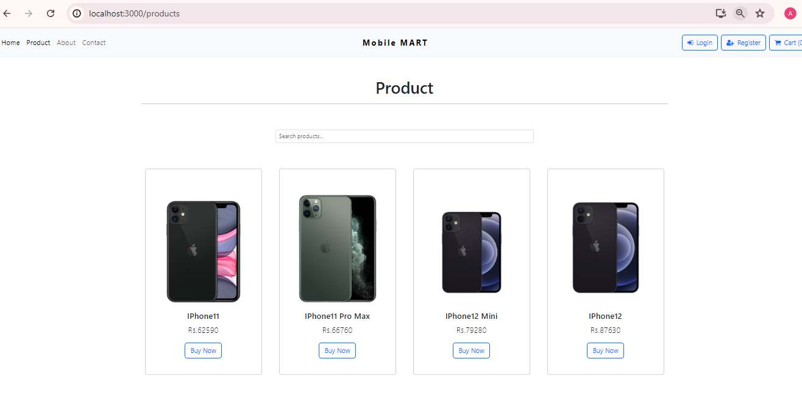

## React E-commerce Application
Welcome to our React-based e-commerce application! This project provides a simple yet robust setup for managing an online store, complete with product listings, a shopping cart, and checkout functionality.

## Table of Contents
# Features
# Installation
# Usage
# Dependencies
# Contributing

### Screenshots

## Features
Homepage: Displays a welcome message and highlights featured products.
Products Page: Lists all available products.
Product Detail Page: Shows detailed information about a specific product.
Cart: Manages items added for purchase.
Checkout: Facilitates the payment process for selected items.
About: Provides information about the company or website.
Contact: Offers ways to get in touch with customer support.

## Installation
To run this application locally, follow these steps:

Clone the repository:

bash
Copy code
git clone https://github.com/Aniketdk/E-Commerce-Website.git
cd E-Commerce-Website

## Install dependencies:

### bash
Copy code
npm i ,
npm i react-react-dom ,
npm i react-router-dom ,
npm i react-redux ,
npm i bootstrap 

### bash
Start the development server:
npm start
Open http://localhost:3000 to view it in the browser.

### Usage
Navigate through different sections using the header navigation links.
Explore products, view details, add items to the cart, and proceed to checkout.
Learn more about the company or get in touch via the About and Contact pages.

## Dependencies
This project relies on the following major dependencies:

react and react-dom: Core libraries for building user interfaces with React.
react-router-dom: Declarative routing for React applications.
bootstrap : CSS framework for styling components.
react reduxjs/toolkit :  Redux Toolkit and React-Redux configured appropriately for that build tool, and come with a small example app that demonstrates how to use several of Redux Toolkit's features. 

## Contributing
Contributions are welcome! If you have any suggestions, enhancements, or bug fixes, please submit a pull request. For major changes, please open an issue first to discuss what you would like to change.
